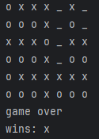

# Connect4 Game Project

    

## Description
This project implements a Connect4 game in Python with various agents capable of playing against each other or against a human player. The agents include random decision-making, minimax algorithm with and without heuristics, and alpha-beta pruning.

## Files

### `connect4.py`
This file contains the core game logic for Connect4.

- **Class `Connect4`**: Manages the game state, including the board, moves, and checking for game over conditions.
  - `__init__(self, width=5, height=4)`: Initializes the board with the specified dimensions.
  - `possible_drops(self)`: Returns a list of columns where a token can be dropped.
  - `drop_token(self, n_column)`: Drops a token in the specified column.
  - `center_column(self)`: Returns the center column of the board.
  - `iter_fours(self)`: Generates all possible sets of four tokens in rows, columns, and diagonals.
  - `_check_game_over(self)`: Checks if the game is over and determines the winner.
  - `draw(self)`: Prints the current state of the board.

### `exceptions.py`
Defines custom exceptions used in the project.

- **Class `GameplayException`**: Raised for invalid game moves or game over states.
- **Class `AgentException`**: Raised for invalid agent actions.

### `randomagent.py`
Implements a random decision-making agent.

- **Class `RandomAgent`**: Decides on a random valid move.
  - `__init__(self, my_token='o')`: Initializes the agent with a token.
  - `decide(self, connect4)`: Returns a random valid column to drop the token.

### `minmaxagent.py`
Implements the MinMax algorithm with heuristics.

- **Class `MinMaxAgent`**: Uses the MinMax algorithm to decide the best move.
  - `__init__(self, my_token='x', depth=4)`: Initializes the agent with a token and search depth.
  - `decide(self, connect4)`: Returns the best column to drop the token based on the MinMax algorithm.
  - `minmax(self, board, depth, maximizingPlayer)`: The MinMax algorithm implementation.
  - `heuristic(self, board)`: Evaluates the board state.

### `minmaxbezheur.py`
Implements the MinMax algorithm without heuristics.

- **Class `MinMaxAgentbez`**: Uses the MinMax algorithm without heuristics to decide the best move.
  - `__init__(self, my_token='x', depth=4)`: Initializes the agent with a token and search depth.
  - `decide(self, connect4)`: Returns the best column to drop the token based on the MinMax algorithm.
  - `minmax(self, board, depth, maximizingPlayer)`: The MinMax algorithm implementation without heuristics.

### `alphabetaagent.py`
Implements the Alpha-Beta pruning algorithm.

- **Class `AlphaBetaAgent`**: Uses Alpha-Beta pruning to decide the best move.
  - `__init__(self, my_token='x', depth=4)`: Initializes the agent with a token and search depth.
  - `decide(self, connect4)`: Returns the best column to drop the token based on the Alpha-Beta algorithm.
  - `alphabeta(self, board, depth, alpha, beta, maximizingPlayer)`: The Alpha-Beta pruning algorithm implementation.
  - `heuristic(self, board)`: Evaluates the board state.

### `pvp.py`
Allows two human players to play against each other.

- **Main loop**: Runs the game, alternating between players until the game is over.

### `avp.py`
Allows a human player to play against the MinMax agent.

- **Main loop**: Runs the game, alternating between the human player and the MinMax agent until the game is over.

### `ava.py`
Allows two agents to play against each other.

- **Main loop**: Runs the game, alternating between two agents (MinMaxAgentbez and AlphaBetaAgent) until the game is over.

## Usage
To play the game, run the desired script from the command line:
- For human vs. human: `python pvp.py`
- For human vs. agent: `python avp.py`
- For agent vs. agent: `python ava.py`

